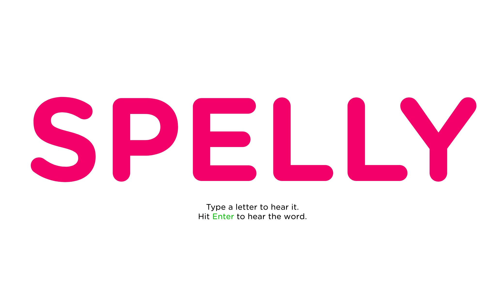

# Spelly 🔤

A fun, interactive spelling tool for kids that uses text-to-speech to help them learn!

**Live Site:** https://meandmybadself.github.io/spelly



## Overview

My 5yo loves mashing on keyboards, we might as well teach him how to spell, right?

## Features

- **Say Words Mode**: Type letters and hear them spoken aloud
- **Spell Words Mode**: Practice spelling common words with audio feedback
- **Confetti celebrations** for correct answers and special names
- **Fullscreen support** for distraction-free learning
- **Typography.com fonts** for beautiful, readable text

## Development

This project uses:
- React 18 with modern hooks
- pnpm for package management
- Typography.com for web fonts
- GitHub Pages for hosting

### Getting Started

```bash
# Install dependencies
pnpm install

# Start development server
pnpm start

# Build for production
pnpm build
```

## Deployment

The site is hosted on GitHub Pages, serving from the `main` branch.

To deploy:
1. Build the project: `BUILD_PATH='./' pnpm build`
2. Commit and push the changes to the `main` branch
3. GitHub Pages will automatically serve the updated site

**GitHub Pages Settings:**
- Source: Deploy from a branch
- Branch: main
- Folder: /
